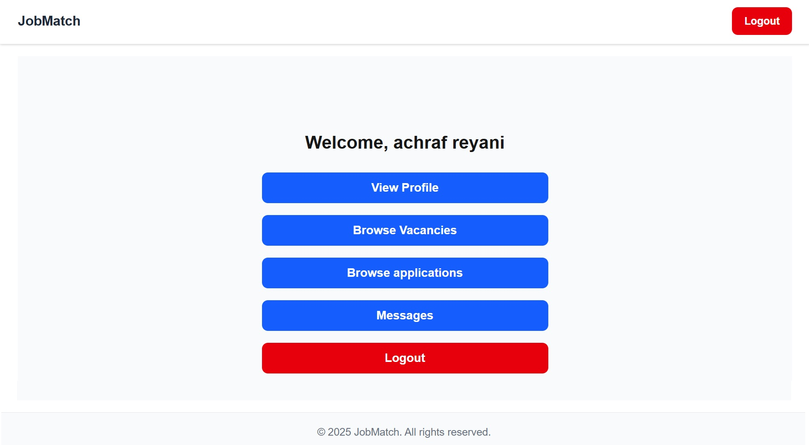

# JobMatch --- Modern Job Matching Platform

 
## 🚀 Overview

**JobMatch** is a fully hosted, modern full-stack job-matching platform that helps companies find talent and job seekers discover opportunities.

Job seekers can create a profile, browse vacancies, and apply to jobs. Companies can post vacancies, review applicants, and manage applications. Once an application is accepted, both parties can communicate directly through a built-in messaging system.

The platform is built using a Next.js frontend and a NestJS backend, with a PostgreSQL database managed through Prisma.

------------------------------------------------------------------------

## 🔗 Live Demo

🎬 **Watch the Demo Video:** [Click here to see it in action](https://youtu.be/A71nbICsReg)  

💻 **Try it Yourself:** Experience the project firsthand by visiting [the live site](https://job-matching-website.vercel.app/)  

------------------------------------------------------------------------

## ✨ Features

### 👤 For Job Seekers

-   Create an account and manage your profile
-   Browse open vacancies
-   Apply to jobs instantly
-   View status of applications
-   Direct messaging with companies

### 🏢 For Companies

-   Create an account and manage your profile
-   Create, edit and delete job vacancies
-   View applicants for each vacancy
-   Accept or reject applications from job seekers
-   Direct messaging with job seekers

------------------------------------------------------------------------

## 🧱 Tech Stack

### Frontend

-   Next.js (App Router)
-   TypeScript
-   TailwindCSS

### Backend

-   NestJS
-   TypeScript
-   Prisma ORM
-   JWT Authentication

### Database

-   PostgreSQL

### Infrastructure

-   Supabase (Database Hosting)
-   Vercel (Frontend Hosting)
-   Render (Backend Hosting)
-   Prisma Migrations & Client Generation

------------------------------------------------------------------------

## 📘 Documentation

Full setup instructions, architecture notes, and deployment details can
be found in the `/docs` folder.

------------------------------------------------------------------------

## 🤝 Contributing

Contributions are welcome! See **[CONTRIBUTING.md](CONTRIBUTING.md)** for a
one-command local setup (`docker compose up`), the test/lint commands, and
project conventions. Good first issues are labelled
[`good first issue`](https://github.com/AchrafReyani/job-matching-platform/labels/good%20first%20issue).

Optional: the backend can offer **"Continue with LINE"** via
[renkei](https://github.com/AchrafReyani/renkei) (a self-hosted OIDC broker
for LINE Login). It stays disabled unless the `RENKEI_*` env vars are set —
see `apps/backend/.env.example`.

------------------------------------------------------------------------

## 📜 License

Licensed under the **Apache-2.0 License**.

------------------------------------------------------------------------

## 🙌 Final Notes

I built JobMatch because I wanted to create something that feels like a real product — not just another school-style project. Along the way, I pushed myself to handle everything from role-based flows to messaging, deployment pipelines, and a more “production-like” architecture.

I made plenty of mistakes, refactored a lot, and learned even more about structuring full-stack applications in a way that’s maintainable and realistic. I’m proud of where the project is now, and even more motivated to keep improving it.

Thanks for taking the time to look through it — and if you have feedback or ideas, I’d genuinely love to hear them.
